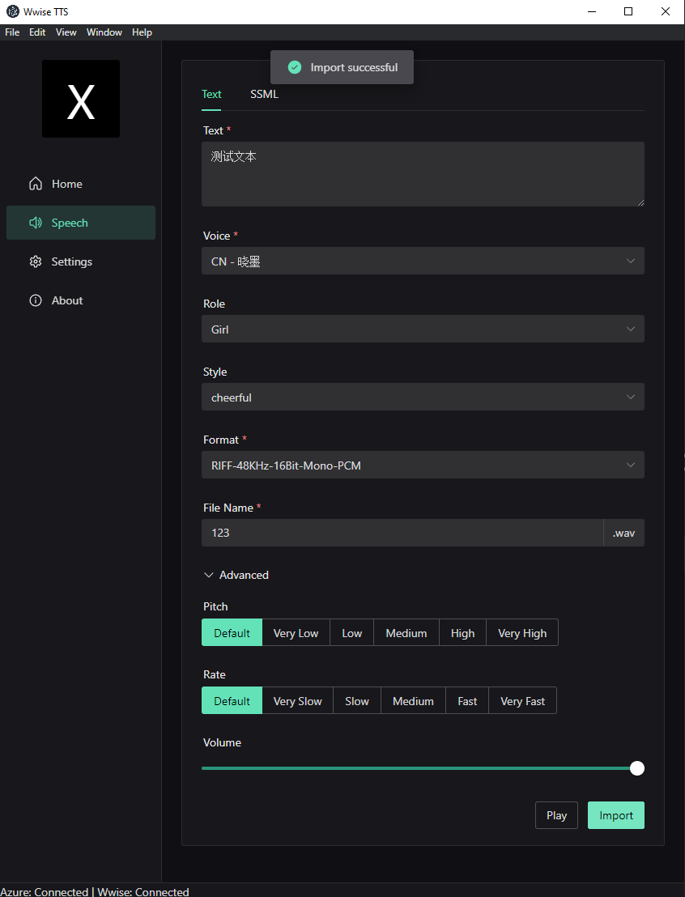
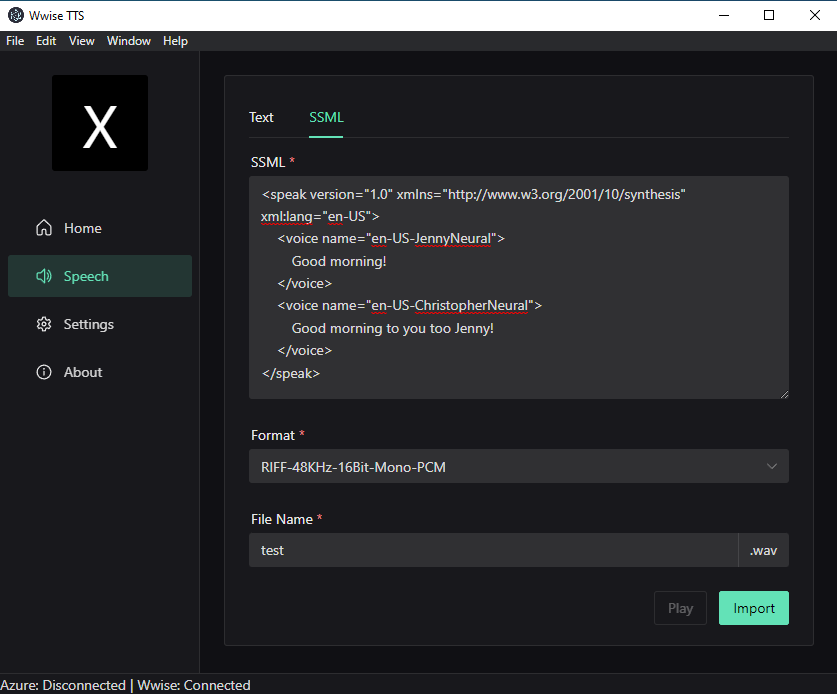
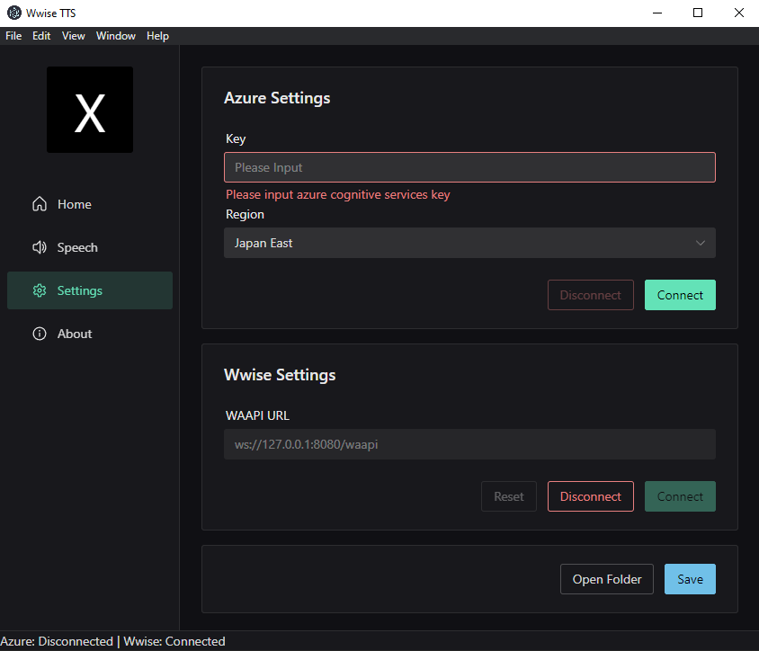

# wwise-tts

Generate speech wave file and import to Wwise Authoring directly！

A Text-to-Speech Application powered by Azure witch support anvanced options.

## Build
```
npm install
npm run build
```

## Dev

```
npm run dev
```

## Screenshots






